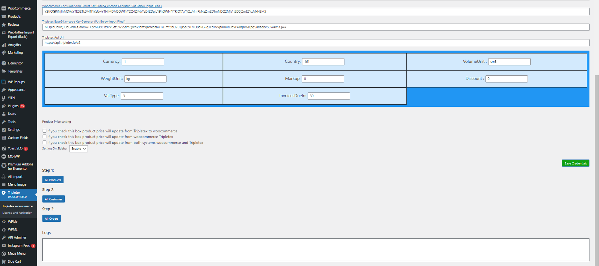

# Overview

**Project name**: Kakle

**Client**: Nohman in Norway

**Specs**: To develop WordPress plugin

**Stages**:

1. Analyze the [kakle.net](http://kakle.net) website
2. Define the project scope
3. Analyze the tripletex API and test the api for authentication
4. Test the APIs related to the project scope
5. Make sample WP plugin
6. Check the similar tripletex Plugin
7. Develop WP plugin

# Information

## kakle.net

WP login credentials:

FTP/CPanel:

## tripletex

**Key and Token:**

- Consumer Key: eyJ0b2tlbklkIjoyMTYzLCJ0b2tlbiI6InRlc3QtODc4Mzk5MzAtYTg4ZC00MDI3LWIzOGEtZDRmNzIzOTcxN2E0In0=
- Employee Token: eyJ0b2tlbklkIjozNTI3LCJ0b2tlbiI6InRlc3QtNzE1YjlmMTYtZWU2OS00MzA4LWJjZjAtNDE0M2EyOTJhYjdkIn0=

**Login Information to Tripletex:**

- Login URL: https://api.tripletex.io/execute/login?username=nohman@wonderwave.io
- Username: [nohman@wonderwave.io](mailto:nohman@wonderwave.io)
- Password: Test-1mXsQZFrN

# Notes

## Similar WP Plugin:

## Scopes

1. Authentication
2. Products
3. Customers
4. Orders
5. WP webhook
